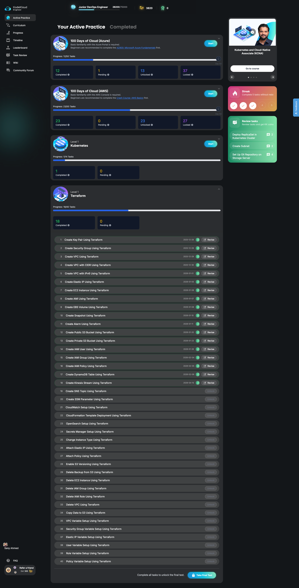

# KodeCloud Terraform Labs

This repository contains my hands-on implementations of the **KodeCloud Terraform Labs**, structured as a progressive learning path covering core to advanced Terraform concepts using AWS resources.

The objective of this project is to build practical, reproducible Infrastructure as Code (IaC) examples while reinforcing Terraform best practices such as modularization, variables, state management, and incremental resource lifecycle management.

---

## 📌 Project Overview

* **Platform**: KodeCloud
* **Tooling**: Terraform
* **Cloud Provider**: AWS (primarily via LocalStack for local testing where applicable)
* **Level**: Terraform – Level 1
* **Focus Areas**:

  * AWS infrastructure provisioning
  * Resource dependencies
  * Variables and outputs
  * Incremental infrastructure changes
  * Clean teardown and lifecycle control

---

## 📂 Repository Structure

Each KodeCloud lab is implemented in an **independent folder**. This keeps labs isolated, easy to validate, and simple to destroy without impacting others.

```
kodecloud-terraform/
├── aws-keypair-setup/
│   ├── provider.tf   # Provider configuration for the lab
│   ├── main.tf       # Terraform resources for the task
│   └── task.md       # KodeCloud lab instructions
│
├── aws-security-group-setup/
│   ├── provider.tf
│   ├── main.tf
│   └── task.md
│
├── aws-vpc-with-ipv4-cidr/
│   ├── provider.tf
│   ├── main.tf
│   └── task.md
│
.... so on
│
└── README.md
```

### File Responsibilities

* **provider.tf**: AWS provider configuration (region, credentials, endpoints)
* **main.tf**: Terraform resources required to complete the lab
* **task.md**: Original KodeCloud lab description and requirements

This structure ensures each lab can be executed independently using standard Terraform workflows.

---


## All labs



## ✅ Completed Labs

1. Create Key Pair Using Terraform
2. Create Security Group Using Terraform
3. Create VPC Using Terraform
4. Create VPC with CIDR Using Terraform
5. Create VPC with IPv6 Using Terraform
6. Create Elastic IP Using Terraform
7. Create EC2 Instance Using Terraform
8. Create AMI Using Terraform
9. Create EBS Volume Using Terraform
10. Create EBS Snapshot Using Terraform
11. Create CloudWatch Alarm Using Terraform
12. Create DynamoDB Table Using Terraform
13. Create IAM Group Using Terraform
14. Create S3 Bucket Using Terraform
15. Create S3 Bucket with Block Public Access Using Terraform
16. IAM Setup Using Terraform
17. Create IAM Policy with Permissions Using Terraform
18. Create Kinesis Stream Using Terraform


---

## 🔒 Upcoming / Locked Labs

The following labs will be implemented as they are unlocked in the KodeCloud platform:

* Snapshot Creation
* CloudWatch Alarms
* Public & Private S3 Buckets
* IAM Users, Groups, Roles, and Policies
* DynamoDB, SNS, Kinesis
* Secrets Manager & SSM Parameters
* CloudFormation via Terraform
* OpenSearch Setup
* Variable-driven Infrastructure (VPC, SG, IAM, Policies)
* Resource Deletion & Cleanup Scenarios

---

## ⚙️ Prerequisites

* Terraform >= 1.x
* AWS CLI (configured if using real AWS)
* LocalStack (optional, for local AWS emulation)
* Basic understanding of AWS services

---

## 🚀 Usage

Initialize Terraform:

```
terraform init
```

Validate configuration:

```
terraform validate
```

Plan infrastructure changes:

```
terraform plan
```

Apply configuration:

```
terraform apply
```

Destroy resources when finished:

```
terraform destroy
```

---

## 🧠 Learning Goals

* Understand Terraform resource lifecycle
* Manage AWS infrastructure declaratively
* Use variables and outputs effectively
* Handle dependencies and ordering
* Apply best practices for clean, maintainable IaC

---

## 📖 Notes

* Each lab aligns strictly with KodeCloud task requirements.
* Code is intentionally kept explicit and readable for learning purposes.
* Refactoring into modules is done only when it adds conceptual value.

---

## 📜 License

This repository is for educational purposes. All implementations are based on personal learning and experimentation.

---

**Author**: Sunny
